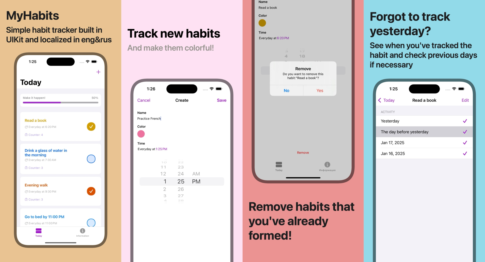

# MyHabits

### Screenshots

MyHabits is a visually engaging and intuitive habit-tracking application for iOS. It empowers users to create and manage their daily habits effortlessly while providing a vibrant and user-friendly interface.

---

## Features 🌟

- **✨ Add New Habits:** Easily create habits by specifying a name, choosing a unique color, and setting a preferred time.
- **🎨 Custom Color Picker:** Personalize each habit with your favorite colors using the built-in color picker.
- **⏰ Daily Habit Time:** Set a daily schedule for your habits with a convenient time picker.
- **⚠️ Validation:** Receive helpful alerts if you attempt to save a habit without entering a name.
- **💾 Habit Storage:** Automatically save all your habits using User Defaults, ensuring they are available for future reference.

---

## Technologies Used 🛠️

- **Programming Language:** Swift
- **Frameworks:** UIKit
- **Layout:**  
- **Data Storage:** User Defaults
- **Design Architecture:** MVC 

---

## How It Works 🤔

1. **Launch the App:** Open MyHabits on your iOS device.
2. **Create a Habit:**
   - Tap the "Create Habit" button.
   - Provide the required details, including the habit name, color, and time.
   - Tap "Save" to add the habit to your list.
3. **Habit Management:**
   - Tap on a habit to view its details.
   - Edit or delete the habit as needed.

---

## Contact ✉️

Have questions or want to contribute? Reach out to the developer:

- **Author:** Amelia Shekikhacheva
- **Email:** [ameliashe@icloud.com](mailto\:ameliashe@icloud.com)
- **GitHub:** [username](https://github.com/username)

